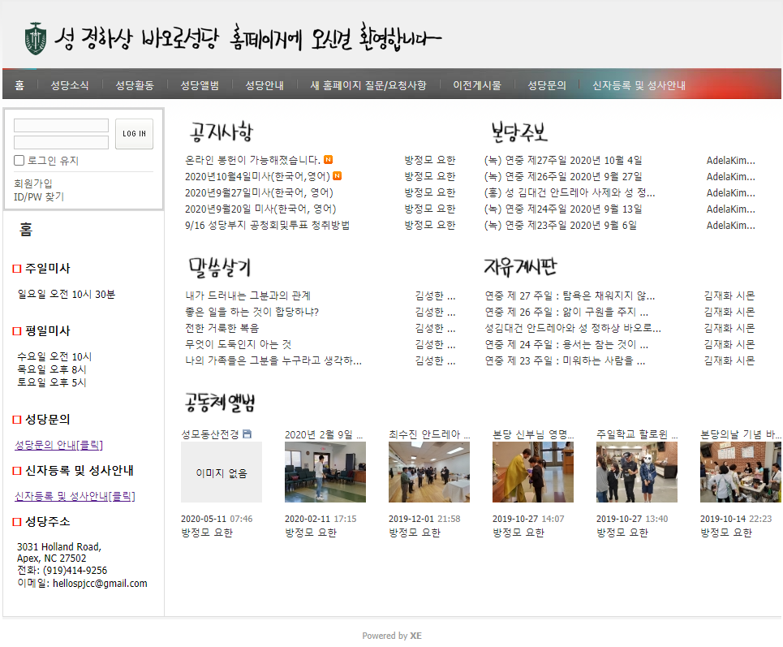

# Kiha Kim

Aspiring UX/UI designer based in Chapel Hill, North Carolina (originally from Seoul, South Korea).
NC State grad, customer service representative, full-time problem spotter

## My Projects

### spjcc.org redesign

  

**About this project**

Saint Ha-Sang Paul Jung Catholic Church is a Korean Catholic church in Apex, North Carolina. I am the volunteer webmaster for this church.

**The problem**

The previous version of this website was created by a programmer who could no longer manage the website, and other church members did not have any programming experience. 

**The objective**

As the new webmaster, I was tasked with creating a new version of the website on a platform that did not require programming experience to edit. This would make the website more sustainable and easier to manage across volunteer personnel changes.

**The solution**

I consulted with the church priest on the best solution for the website. We decided to use a platform called XpressEngine (XE), a content management system created by the Korean development company Naver. Because XE is a Korean-language platform and it is free to use for nonprofits, we decided this would be an ideal solution for the church website.

**Team**

I collaborated with another web volunteer and a font designer to recreate the website.

**My role**

I developed the structure of the website, including the homepage and navigation. I also developed the UI of the site and migrated content from the previous site over to the current site.

**Skills used**

Content organization, design thinking, content management systems, HTML
